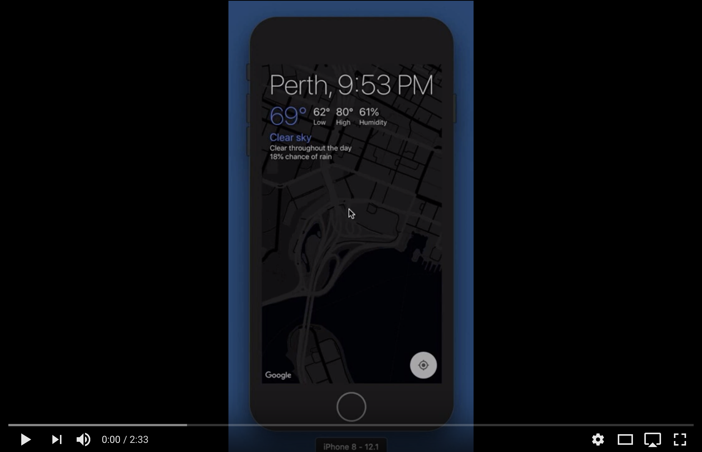

# Here & Now

Here & Now is an iOS weather app written in Swift. I made it to explore how I might structure an app using [RxSwift](https://github.com/ReactiveX/RxSwift).

[](https://youtu.be/Vy_SPEK0eJE)

## Main Themes

* View controllers are [deliberately minimal](https://github.com/vyshane/here-and-now/blob/master/Here%20and%20Now/Current%20Info/CurrentInfoViewController.swift). They wire up their root `ViewComponent` and add its subview.
* Nested `ViewComponent`s are used to break the UI code down to manageable pieces
* UI state changes are defined by pure functions that operate on Rx types
* UI logic is implemented in component protocol extensions for ease of testing

A `ViewComponent` is defined as

```swift
protocol ViewComponent {
    // Streams used by the component
    associatedtype Inputs
    
    // Streams produced by the component
    associatedtype Outputs
    
    // Root view of the component, used to add as subview of parent component
    var view: UIView { get }
    
    init(disposedBy: DisposeBag)
    
    // Subscribe to input streams, export any streams produced by component
    func start(_ inputs: Inputs) -> Outputs
}

extension ViewComponent {
    // Stop any services started by the component
    func stop() {}
}
```