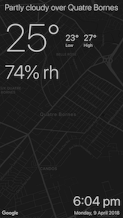

# Here & Now

Here & Now is an iOS weather app written in Swift. I made it to explore how I might structure an app using [RxSwift](https://github.com/ReactiveX/RxSwift).

## Main Themes

* View controllers are [deliberately minimal](https://github.com/vyshane/here-and-now/blob/master/Here%20and%20Now/Current%20Info/CurrentInfoViewController.swift)
* Nested components are used to break the UI code down to manageable pieces
* UI state changes are defined by pure functions that operate on Rx types
* UI logic is implemented in component protocol extensions for ease of testing
